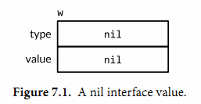

## 7.5.  接口值
概念上讲一个接口的值，接口值，由两个部分组成，一个具体的类型和那个类型的值。它们被称为接口的动态类型和动态值。对于像Go语言这种静态类型的语言，类型是编译期的概念；因此一个类型不是一个值。在我们的概念模型中，一些提供每个类型信息的值被称为类型描述符，比如类型的名称和方法。在一个接口值中，类型部分代表与之相关类型的描述符。

下面4个语句中，变量w得到了3个不同的值。（开始和最后的值是相同的）

```go
var w io.Writer
w = os.Stdout
w = new(bytes.Buffer)
w = nil
```

让我们进一步观察在每一个语句后的w变量的值和动态行为。第一个语句定义了变量w:

```go
var w io.Writer
```

在Go语言中，变量总是被一个定义明确的值初始化，即使接口类型也不例外。对于一个接口的零值就是它的类型和值的部分都是nil（图7.1）。



一个接口值基于它的动态类型被描述为空或非空，所以这是一个空的接口值。你可以通过使用w==nil或者w!=nil来判断接口值是否为空。调用一个空接口值上的任意方法都会产生panic:

```go
w.Write([]byte("hello")) // panic: nil pointer dereference
```

第二个语句将一个`*os.File`类型的值赋给变量w:

```go
w = os.Stdout
```

这个赋值过程调用了一个具体类型到接口类型的隐式转换，这和显式的使用io.Writer(os.Stdout)是等价的。这类转换不管是显式的还是隐式的，都会刻画出操作到的类型和值。这个接口值的动态类型被设为`*os.File`指针的类型描述符，它的动态值持有os.Stdout的拷贝；这是一个代表处理标准输出的os.File类型变量的指针（图7.2）。


调用一个包含`*os.File`类型指针的接口值的Write方法，使得`(*os.File).Write`方法被调用。这个调用输出“hello”。

```go
w.Write([]byte("hello")) // "hello"
```

通常在编译期，我们不知道接口值的动态类型是什么，所以一个接口上的调用必须使用动态分配。因为不是直接进行调用，所以编译器必须把代码生成在类型描述符的方法Write上，然后间接调用那个地址。这个调用的接收者是一个接口动态值的拷贝，os.Stdout。效果和下面这个直接调用一样：

```go
os.Stdout.Write([]byte("hello")) // "hello"
```

第三个语句给接口值赋了一个*bytes.Buffer类型的值

```go
w = new(bytes.Buffer)
```

现在动态类型是*bytes.Buffer并且动态值是一个指向新分配的缓冲区的指针（图7.3）。


Write方法的调用也使用了和之前一样的机制：

```go
w.Write([]byte("hello")) // writes "hello" to the bytes.Buffers
```

这次类型描述符是\*bytes.Buffer，所以调用了(\*bytes.Buffer).Write方法，并且接收者是该缓冲区的地址。这个调用把字符串“hello”添加到缓冲区中。

最后，第四个语句将nil赋给了接口值：

```go
w = nil
```

这个重置将它所有的部分都设为nil值，把变量w恢复到和它之前定义时相同的状态，在图7.1中可以看到。

一个接口值可以持有任意大的动态值。例如，表示时间实例的time.Time类型，这个类型有几个对外不公开的字段。我们从它上面创建一个接口值,

```go
var x interface{} = time.Now()
```

结果可能和图7.4相似。从概念上讲，不论接口值多大，动态值总是可以容下它。（这只是一个概念上的模型；具体的实现可能会非常不同）


接口值可以使用==和!＝来进行比较。两个接口值相等仅当它们都是nil值，或者它们的动态类型相同并且动态值也根据这个动态类型的==操作相等。因为接口值是可比较的，所以它们可以用在map的键或者作为switch语句的操作数。

然而，如果两个接口值的动态类型相同，但是这个动态类型是不可比较的（比如切片），将它们进行比较就会失败并且panic:

```go
var x interface{} = []int{1, 2, 3}
fmt.Println(x == x) // panic: comparing uncomparable type []int
```

考虑到这点，接口类型是非常与众不同的。其它类型要么是安全的可比较类型（如基本类型和指针）要么是完全不可比较的类型（如切片，映射类型，和函数），但是在比较接口值或者包含了接口值的聚合类型时，我们必须要意识到潜在的panic。同样的风险也存在于使用接口作为map的键或者switch的操作数。只能比较你非常确定它们的动态值是可比较类型的接口值。

当我们处理错误或者调试的过程中，得知接口值的动态类型是非常有帮助的。所以我们使用fmt包的%T动作:

```go
var w io.Writer
fmt.Printf("%T\n", w) // "<nil>"
w = os.Stdout
fmt.Printf("%T\n", w) // "*os.File"
w = new(bytes.Buffer)
fmt.Printf("%T\n", w) // "*bytes.Buffer"
```

在fmt包内部，使用反射来获取接口动态类型的名称。我们会在第12章中学到反射相关的知识。


